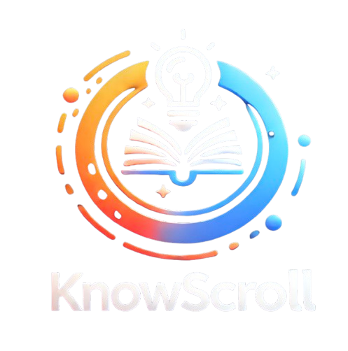
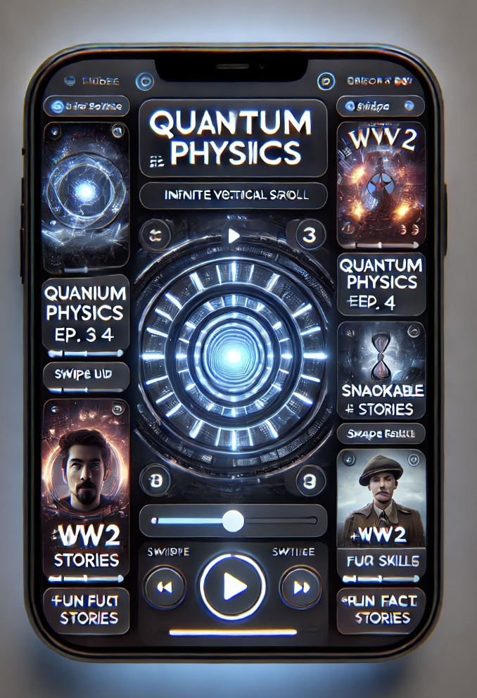
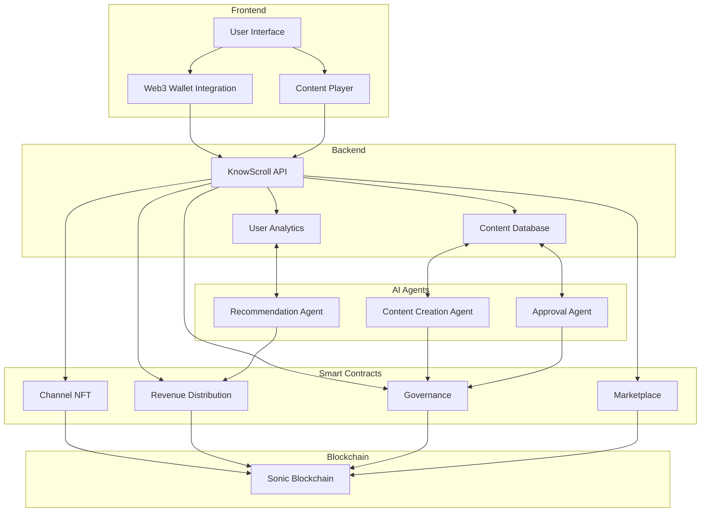
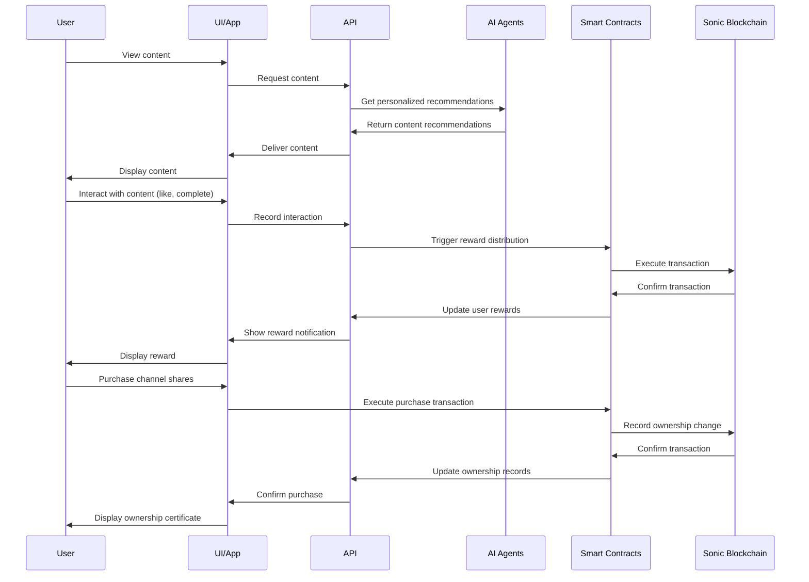
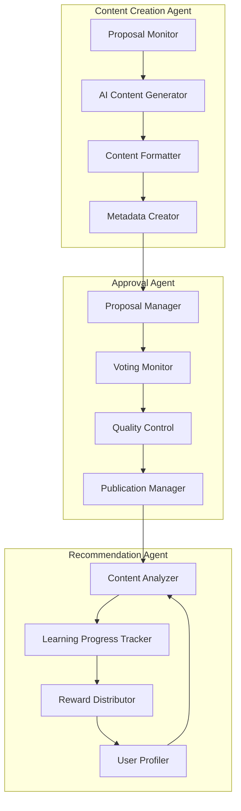
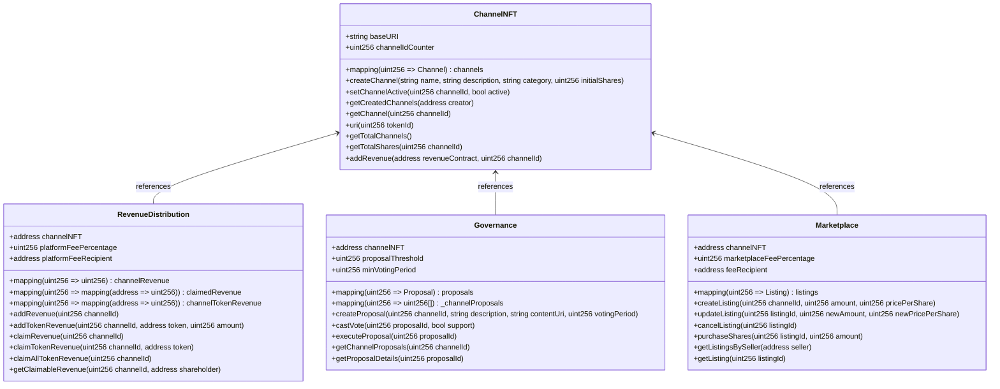

# KnowScroll: Transform Mindless Scrolling into Meaningful Learning

<div align="center">
  
  
  <h3>AI-Generated Reel Content with Web3 Ownership</h3>
  
  <p>
    <a href="#features">Features</a> •
    <a href="#architecture">Architecture</a> •
    <a href="#technical-stack">Technical Stack</a> •
    <a href="#installation">Installation</a> •
    <a href="#getting-started">Getting Started</a> •
    <a href="#ai-agents">AI Agents</a> •
    <a href="#blockchain-components">Blockchain</a> •
    <a href="#roadmap">Roadmap</a>
  </p>

  <p><em>Built for the <a href="https://docs.soniclabs.com/">Sonic DeFAI Hackathon</a> - February 2025</em></p>
</div>

## 🌟 Overview

**KnowScroll** reimagines social media as a productive, enriching experience by transforming the endless scroll of entertainment into an educational micro-learning platform powered by AI and blockchain technology.

Instead of random content, users swipe through **AI-generated educational content** organized into coherent learning sequences. Each interaction not only builds knowledge but also generates on-chain rewards. The platform's decentralized ownership model allows users to purchase fractional NFT shares in their favorite content channels, earning revenue and governing future content direction.

<div align="center">
  
</div>

### 💡 The Problem

- **Time Wasted**: The average person spends 40-45 minutes daily on social media with nothing of value to show for it
- **Guilt and FOMO**: Endless scrolling creates post-browsing guilt and empty feelings
- **Centralized Control**: Traditional platforms give users no stake in the content they consume

### 🚀 The Solution

KnowScroll transforms social media by keeping its addictive qualities while making every moment valuable:

- **Educational Micro-Content**: AI-generated, expert-curated educational content in an engaging format
- **Structured Learning Paths**: Topics follow logical sequences with related content organized by theme
- **Decentralized Ownership**: Purchase shares in channels, earn revenue, and govern content direction
- **Token-Based Incentives**: Earn rewards for learning and engaging with content

## ✨ Features

### 📱 Content Experience

- Instagram-like vertical swipe interface with horizontal navigation between topics
- AI-curated educational content streams based on user interests
- Thematic learning channels with coherent knowledge progression
- Adaptive content that adjusts to user learning pace and preferences
- Mindful scrolling features with wellbeing prompts and insights

### 🔍 Discovery

- Explore trending channels across categories (Science, History, Tech, Arts, etc.)
- Personalized recommendations based on engagement and learning patterns
- Community ratings and expert curation for quality content
- Challenge modes for focused, gamified learning experiences

### 💰 Tokenomics and Marketplace

- Purchase fractional ownership in content channels as NFTs
- Earn channel revenue based on ownership percentage
- Token rewards for engagement and learning milestones
- Secondary marketplace for buying/selling channel shares

### 🧠 AI-Powered Content Creation

- Automated content generation based on channel themes and proposals
- Expert and community curation through decentralized governance
- Content editing tools for channel owners and stakeholders
- Quality control mechanisms for educational integrity

### 🗳️ Governance

- On-chain voting for channel direction and content priorities
- Proposal system for new content sequences and features
- Reputation system for curators and content creators
- Transparent revenue distribution to all stakeholders

## 🏗️ Architecture

KnowScroll consists of three main components that work together to create a seamless user experience:

1. **Frontend Application**: The user interface and content delivery system
2. **Smart Contract System**: Handles ownership, governance, and rewards
3. **AI Agent Network**: Powers content creation, curation, and personalization

### System Architecture Diagram



### Data Flow Diagram



## 🔧 Technical Stack

### Frontend

- **Framework**: Next.js with React 18
- **Styling**: Tailwind CSS
- **State Management**: React Context API
- **Web3 Integration**: ethers.js, Web3Modal
- **Content Delivery**: Progressive loading, client-side caching

### Smart Contracts

- **Language**: Solidity 0.8.26
- **Development Framework**: Hardhat
- **Testing**: Chai, Ethers.js
- **Deployment**: Hardhat, Infura
- **Contract Architecture**: ERC-1155 for multi-token functionality

### AI Agents

- **Framework**: ZerePy (Python-based agent framework)
- **LLM Integration**: OpenAI, Anthropic Claude
- **Content Generation**: GPT-4, Claude 3.7 Sonnet
- **Media Creation**: DALL-E 3, Midjourney integration
- **Analytics**: TensorFlow for user behavior analysis

### Blockchain

- **Network**: Sonic Blockchain
- **Performance**: 10,000 TPS with sub-second finality
- **Ethereum Compatibility**: Full EVM compatibility
- **Developer Tools**: Chainlink, Safe, Pyth integration

## 📦 Installation

### Prerequisites

- Node.js (v18.0.0+)
- Python 3.10+ (for AI agents)
- Poetry (for Python dependency management)
- Hardhat (for smart contract development)
- Metamask or other Web3 wallet

### Frontend Setup

```bash
# Clone the repository
git clone https://github.com/Legend101Zz/DEFAI-knowscroll.git

cd knowscroll

# Install dependencies
npm install

# Set up environment variables
cp .env.example .env.local
# Edit .env.local with your configuration

# Start development server
npm run dev
```

### Smart Contract Setup

```bash
# Navigate to the contract directory
cd contracts

# Install dependencies
npm install

# Compile contracts
npx hardhat compile

# Run tests
npx hardhat test

# Deploy to Sonic Blaze testnet
npx hardhat run scripts/deploy.ts --network sonicTestnet
```

### AI Agents Setup

```bash
# Navigate to the agents directory
cd knowscroll-agents

# Install Poetry if not already installed
curl -sSL https://install.python-poetry.org | python3 -

# Install dependencies
poetry install

# Configure agents
cp .env.example .env
# Edit .env with your API keys and configuration

# Start the agent system
poetry run python main.py
```

## 🚀 Getting Started

### Deploying the Smart Contracts

The KnowScroll platform uses a system of four main smart contracts:

1. **ChannelNFT.sol**: Handles fractional ownership of content channels
2. **RevenueDistribution.sol**: Manages revenue allocation to stakeholders
3. **Governance.sol**: Controls voting and proposal systems
4. **Marketplace.sol**: Facilitates buying and selling of channel shares

Deploy them to the Sonic blockchain using:

```bash
# Deploy to Sonic Testnet (Blaze)
npx hardhat run scripts/deploy.ts --network sonicTestnet

# Deploy to Sonic Mainnet
npx hardhat run scripts/deploy.ts --network sonic
```

### Contract Addresses

Once deployed, the contracts will be available at these addresses (example):

| Contract            | Sonic Testnet | Sonic Mainnet |
| ------------------- | ------------- | ------------- |
| ChannelNFT          | 0x...         | 0x...         |
| RevenueDistribution | 0x...         | 0x...         |
| Governance          | 0x...         | 0x...         |
| Marketplace         | 0x...         | 0x...         |

### Creating a Channel

Create your first educational content channel:

```javascript
// Example JavaScript for frontend integration
const channelNFT = new ethers.Contract(
  CHANNEL_NFT_ADDRESS,
  CHANNEL_NFT_ABI,
  signer
);

// Create a new channel with 100 total shares
const tx = await channelNFT.createChannel(
  "History of Computing", // Name
  "The evolution of computers", // Description
  "Technology", // Category
  100 // Total shares (owned by creator initially)
);

await tx.wait();
console.log("Channel created successfully!");
```

### Setting Up AI Agents

The KnowScroll platform utilizes three primary AI agents built with ZerePy:

1. Configure the `Content Creation Agent`:

```bash
cd knowscroll-agents
poetry run configure-connection openai
poetry run load-agent content-creation
```

2. Configure the `Approval Agent`:

```bash
poetry run configure-connection anthropic
poetry run load-agent approval
```

3. Configure the `Recommendation Agent`:

```bash
poetry run configure-connection together
poetry run load-agent recommendation
```

## 🤖 AI Agents

KnowScroll's AI agent system powers the content generation, curation, and recommendation features of the platform. Built using ZerePy, these agents interact with the Sonic blockchain to create a seamless educational experience.

### Agent Architecture



### Content Creation Agent

The Content Creation Agent monitors governance proposals and automatically generates educational content when proposals are approved.

**Key Features:**

- Monitors on-chain governance proposals
- Generates draft content based on proposal parameters
- Creates multi-modal content including text, images, and interactive elements
- Formats content for optimal mobile viewing experience
- Submits content for approval

**Agent Configuration:**

```javascript
// agents/content-creation.json
{
  "name": "ContentCreationAgent",
  "bio": [
    "You are an educational content creator specializing in engaging, bite-sized learning content.",
    "Your goal is to create content that maintains the addictive quality of social media while delivering real educational value."
  ],
  "traits": ["Creative", "Educational", "Engaging", "Accurate"],
  "examples": ["The History of Computing - Part 1: From Abacus to Analytical Engine"],
  "loop_delay": 3600,
  "config": [
    {
      "name": "openai",
      "model": "gpt-4"
    },
    {
      "name": "sonic",
      "network": "mainnet"
    }
  ],
  "tasks": [
    { "name": "monitor-proposals", "weight": 5 },
    { "name": "generate-content", "weight": 10 },
    { "name": "format-content", "weight": 3 }
  ]
}
```

### Approval Agent

The Approval Agent manages the content approval workflow, including stakeholder voting and publication.

**Key Features:**

- Submits content proposals to governance contract
- Monitors voting outcomes
- Performs quality control on approved content
- Publishes content to IPFS
- Updates on-chain metadata

**Agent Configuration:**

```javascript
// agents/approval.json
{
  "name": "ApprovalAgent",
  "bio": [
    "You are a content quality manager who ensures all educational content meets high standards.",
    "You facilitate the governance process and ensure all stakeholders have input on content direction."
  ],
  "traits": ["Discerning", "Fair", "Thorough", "Diplomatic"],
  "loop_delay": 1800,
  "config": [
    {
      "name": "anthropic",
      "model": "claude-3-7-sonnet-20250219"
    },
    {
      "name": "sonic",
      "network": "mainnet"
    }
  ],
  "tasks": [
    { "name": "submit-proposal", "weight": 3 },
    { "name": "monitor-voting", "weight": 5 },
    { "name": "quality-check", "weight": 7 },
    { "name": "publish-content", "weight": 3 }
  ]
}
```

### Recommendation Agent

The Recommendation Agent analyzes user behavior to provide personalized content recommendations and distribute rewards.

**Key Features:**

- Builds user interest profiles
- Analyzes content engagement patterns
- Creates personalized content feeds
- Tracks learning progress
- Triggers on-chain rewards for engagement and learning milestones

**Agent Configuration:**

```javascript
// agents/recommendation.json
{
  "name": "RecommendationAgent",
  "bio": [
    "You are a personalization specialist who understands user learning patterns.",
    "Your goal is to recommend the most engaging and effective content for each user's learning journey."
  ],
  "traits": ["Analytical", "Perceptive", "Adaptive", "Supportive"],
  "loop_delay": 900,
  "config": [
    {
      "name": "together",
      "model": "meta-llama/Meta-Llama-3.1-8B-Instruct-Turbo"
    },
    {
      "name": "sonic",
      "network": "mainnet"
    }
  ],
  "tasks": [
    { "name": "analyze-engagement", "weight": 5 },
    { "name": "update-profile", "weight": 3 },
    { "name": "recommend-content", "weight": 8 },
    { "name": "distribute-rewards", "weight": 4 }
  ]
}
```

## 🔗 Blockchain Components

### Smart Contract Architecture



### Smart Contract Interactions

1. **Channel Creation and Ownership**:

   - Creator calls `ChannelNFT.createChannel()` to create a new channel
   - Initial shares (ERC-1155 tokens) are minted to creator
   - Shares can be transferred to other users
   - Channel metadata and status can be updated by creator

2. **Content Governance**:

   - Stakeholders create proposals using `Governance.createProposal()`
   - Voting period opens for stakeholders (minimum stake required)
   - Stakeholders vote with `castVote()` based on their ownership percentage
   - After voting period, proposals can be executed if approved

3. **Revenue Distribution**:

   - Platform takes fees from user subscriptions and ads
   - Revenue added to channels with `RevenueDistribution.addRevenue()`
   - Stakeholders can claim their portion with `claimRevenue()`
   - Revenue distributed proportionally to share ownership

4. **Marketplace Operations**:
   - Shareholders list shares for sale with `Marketplace.createListing()`
   - Buyers purchase shares with `purchaseShares()`
   - Listings can be updated or canceled by seller
   - Platform takes small fee from each transaction

### Sonic Blockchain Integration

KnowScroll leverages Sonic blockchain's key features:

- **High Performance**: 10,000 TPS and sub-second finality ensure smooth user experience
- **Ethereum Compatibility**: Seamless integration with Ethereum wallets and tools
- **Developer Rewards**: Share of transaction fees (FeeM) incentivizes development
- **Low Fees**: Minimal transaction costs for frequent user interactions

### Gas Optimization Strategies

To ensure efficient operation on the Sonic blockchain:

1. **Batch Operations**: Grouping multiple operations into single transactions
2. **Event-Based Updates**: Using events for off-chain tracking instead of on-chain storage
3. **Proxy Patterns**: Upgradeable contracts for future improvements
4. **Storage Optimization**: Careful packing of variables to minimize storage costs

## 📈 Current Progress & Future Plans

### Current Development Status

- **Smart Contract System**:

  - Deployed functional contracts to Sonic testnet (ChannelNFT, Governance, Marketplace)
  - Implemented fractional ownership and revenue distribution mechanisms
  - Completed initial security audits and optimizations

- **Frontend Application**:

  - Built responsive mobile-first UI with Next.js
  - Developed interactive swipeable content interface
  - Implemented Web3 wallet integration
  - Created channel discovery and exploration pages

- **AI Integration**:
  - Established core ZerePy agent architecture
  - Implemented basic content generation workflows
  - Set up monitoring system for governance proposals
  - Created initial content recommendation engine

### Immediate Next Steps (1-2 Months)

- **AI Content Editor Improvements**:

  - Enhanced template system for consistent educational content
  - Real-time collaborative editing capabilities
  - Advanced formatting tools specifically for educational content
  - Integration with external knowledge bases for fact-checking

- **Reels Video Player Enhancements**:

  - Smoother transitions between content pieces
  - Adaptive resolution based on connection quality
  - Interactive elements overlay (quizzes, bookmarks)
  - Picture-in-picture mode for continuous learning

- **User Experience Refinements**:
  - Content progress tracking and visualization
  - Customizable learning paths
  - Gamification elements for engagement
  - Improved navigation between related topics

### Medium-Term Goals (3-6 Months)

- **Content Creation System**:

  - Multi-modal content generation (text, images, animations)
  - Custom AI fine-tuning for educational content styles
  - Expert review workflow integration
  - Community contribution mechanisms

- **Governance Enhancement**:

  - Topic-specific sub-governance for specialized content
  - Reputation system for content quality
  - Weighted voting based on expertise and engagement
  - Analytics dashboard for proposal outcomes

- **Blockchain Integration**:
  - Mainnet deployment on Sonic
  - Cross-chain compatibility testing
  - Optimization for high-frequency rewards
  - Enhanced token utility features

### Long-Term Vision (6+ Months)

- **Platform Expansion**:

  - Native mobile applications (iOS and Android)
  - Educational institution partnerships
  - Creator studio for professional educational content
  - API for third-party integrations
  - SDK for developer ecosystem

- **Advanced AI Features**:

  - Personalized learning path optimization
  - Adaptive content difficulty based on user performance
  - Multi-language content generation and translation
  - Interactive AI-powered content experiences

- **Ecosystem Development**:
  - Educational content marketplace
  - Expert curator program
  - Certification and credentials system
  - Integration with learning management systems
  - Research partnerships for educational effectiveness

## 🤝 Contributing

We welcome contributions to KnowScroll! Please see our [contributing guidelines](CONTRIBUTING.md) for details.

## 📄 License

This project is licensed under the MIT License - see the [LICENSE](LICENSE) file for details.

## Acknowledgements

- [Sonic Labs](https://www.soniclabs.com/) for the blockchain infrastructure
- [ZerePy](https://github.com/blorm-network/ZerePy) for the AI agent framework
- [OpenAI](https://openai.com/) , [Ollama](https://ollama.com/) and [Anthropic](https://www.anthropic.com/) for AI models
- [Zerebro Team](https://zerebro.ai/) for inspiration and support
- All contributors and hackathon participants

---

<div align="center">
  <p>
   •
    <a href="https://github.com/Legend101Zz/DEFAI-knowscroll">GitHub</a>
  </p>
</div>
